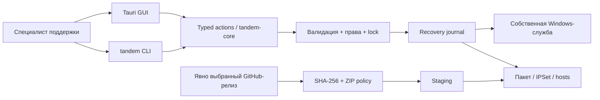

# Tandem Workbench

**Управляемый Zapret для IT-поддержки: проверить пакет, применить стратегию, восстановить состояние.**

Локальное Windows-приложение и CLI для небольших команд и специалистов поддержки. Превращает ручную работу со скриптами в явные, проверяемые операции — без облачного аккаунта и телеметрии.


> **Это не VPN.** Проект управляет сторонним движком Zapret/WinDivert. Он не создаёт туннель, не меняет публичный IP и не добавляет шифрование. Доступность конкретного сервиса зависит от сети, провайдера, стратегии и политики использования.
>
> **Статус поставки:** переработанные исходники, не сертифицированный production-релиз. Frontend проверен локально; Rust, Windows SCM/ACL и установщик в среде ревизии не запускались. Точная граница проверок — [VERIFICATION.md](docs/VERIFICATION.md). Бейджи не изображают несуществующую зелёную CI-сборку.

## Почему Workbench

- 🧾 **Пакет с проверкой SHA-256.** Только конкретный релиз и доверенная сумма, ограниченный ZIP, staging и предыдущая версия.
- 🛡 **Одна собственная служба.** Управление `tandem-zapret`, без массового `taskkill` и удаления чужих драйверов.
- ↩ **Восстановление по журналу.** Служба, пакет и настройки получают recovery point до изменения; hosts восстанавливается отдельно.
- 🔎 **Честная диагностика.** Ошибка Windows не превращается в «службы нет»; HTTP 403 отделён от отсутствия соединения.
- 🧰 **Один движок для GUI и CLI.** Те же проверки, конфигурация и ограничения для интерактивной работы и скриптов поддержки.
- 🔒 **Нулевые npm-зависимости.** Нативные ES-модули, локальный build, CSP и отсутствие shell-плагина в WebView.

## Как это устроено



## Старт за 60 секунд: интерфейс без установки зависимостей

Нужен **Node.js 22+**. Из корня распакованного репозитория:

```sh
cd app
npm test
npm run dev
```

Откройте `http://127.0.0.1:5173`. Это **честно обозначенный read-only preview**: без имитации работы Windows и без системных изменений. Самодостаточный [HTML-preview](docs/assets/preview.html) можно открыть непосредственно как файл.

### Полноценное Windows-приложение

Нужны Windows 11 x64, Rust stable (базовый код использует API Rust 1.89+), MSVC Build Tools + Windows SDK, WebView2 и Tauri CLI 2. Первое скачивание/компиляция Rust-зависимостей занимает больше минуты; [точная установка](docs/DEPLOYMENT.md).

```powershell
cargo test --locked -p tandem-core
cd app
cargo tauri dev
```

Чтение статуса не требует повышения прав. Для изменений запустите приложение или CLI от имени администратора. Пакеты Flowseal/WinDivert **не включены** в этот репозиторий.

## Рабочий сценарий

1. Подготовьте защищённый каталог через GUI или `tandem init`.
2. Получите проверенный ZIP и независимо подтверждённую SHA-256. Импортируйте пакет: рабочие файлы не перезаписываются до окончания staging.
3. Выберите стратегию, посмотрите план, затем явно установите службу. Для нового пакета сначала удалите только службу Tandem.

```powershell
# Выполнять из корня репозитория после сборки CLI.
.\target\release\tandem.exe status
.\target\release\tandem.exe preview "general.bat"
.\target\release\tandem.exe support > support.json
```

Для изменений, импорта и восстановления см. [API / CLI](docs/API.md). `support.json` исключает пользовательские пути, домены, IP, hosts и сырые журналы. Другие JSON-результаты не считаются автоматически обезличенными.

## 📚 Документация

- 📖 [Архитектура и внутреннее устройство](docs/ARCHITECTURE.md)
- ⚙️ [Настройка и конфигурация](docs/CONFIGURATION.md)
- 🚀 [Развертывание и Production](docs/DEPLOYMENT.md)
- 🛠 [API / CLI справочник](docs/API.md)
- 🧭 [Ниша, аудитория и продуктовые гипотезы](docs/PRODUCT.md)
- 🔍 [Аудит исходного кода: файлы, строки, исправления](docs/AUDIT.md)
- 🧯 [Восстановление и диагностика проблем](docs/TROUBLESHOOTING.md)
- ✅ [Что проверено и что осталось проверить](docs/VERIFICATION.md)
- 🔐 [Модель угроз](docs/SECURITY.md) · [Политика безопасности](SECURITY.md)
- 📝 [Changelog](CHANGELOG.md) · [Правила участия](CONTRIBUTING.md)

## Roadmap

- Пройти Windows acceptance matrix и независимую проверку Win32/ACL boundary.
- Подписывать установщик и утверждённые manifests; отделить privileged helper от WebView.
- Добавить проверенные fixtures нескольких версий Flowseal и публичный compatibility matrix.
- Проверить платные пилоты поддержки; централизованный fleet management — отдельная будущая опция, не существующая функция.

WARP, сборщики публичных VPN-конфигураций и «универсальный обход всего» не входят в продуктовый контракт.

## License & attribution

**GPL-3.0-or-later**, исходный [LICENSE](LICENSE) сохранён без изменений. Ревизия основана на [etern1ty-crypto/tandem-vpn](https://github.com/etern1ty-crypto/tandem-vpn). Сторонние проекты — [Flowseal](https://github.com/Flowseal/zapret-discord-youtube), [Zapret](https://github.com/bol-van/zapret), [WinDivert](https://github.com/basil00/WinDivert) — распространяются по собственным лицензиям. Их бинарные файлы здесь не перепубликуются.

Используйте только с разрешением владельца устройства и в соответствии с законом и политикой сети. Предоставление исходников не заменяет юридическую проверку вашей модели распространения.
