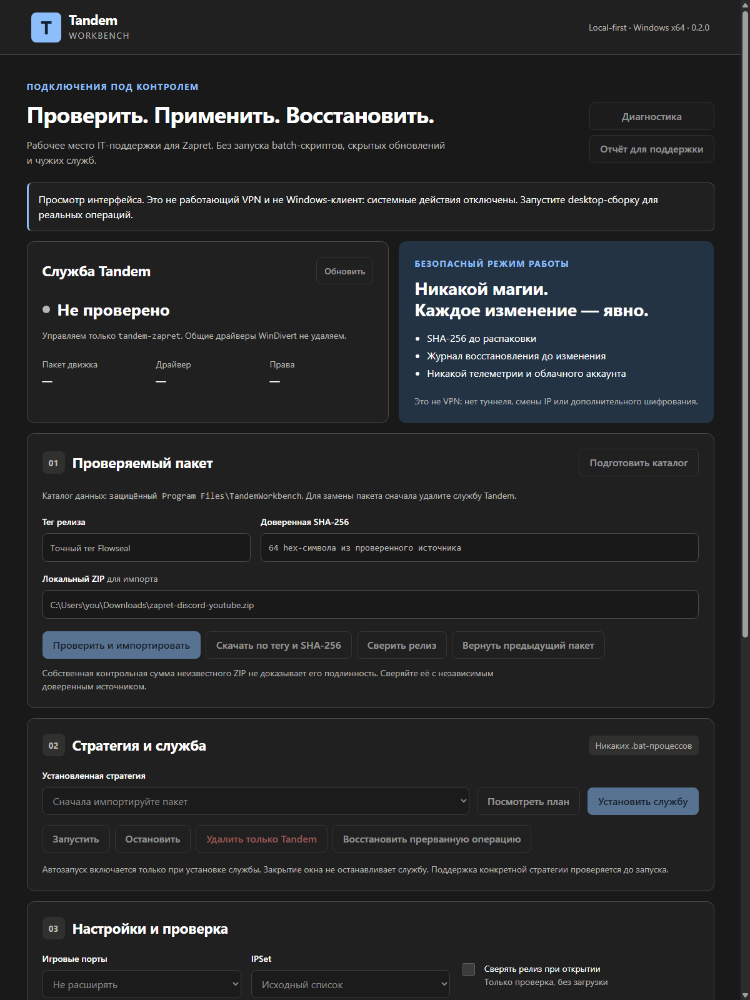
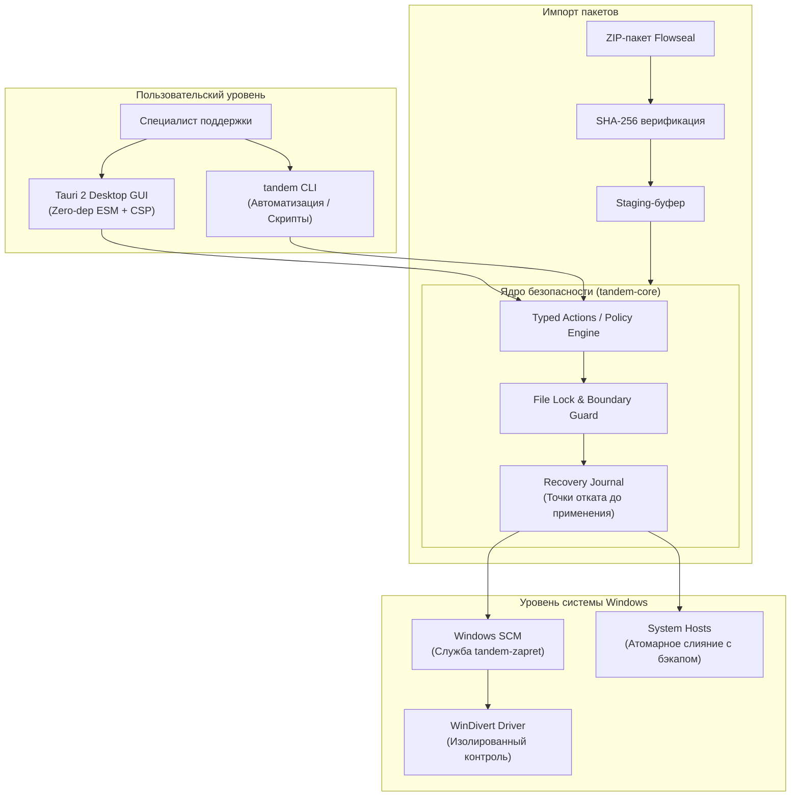

# 🛡️ Tandem Workbench

<p align="center">
  <strong>Управляемый Zapret для IT-поддержки: проверить пакет, применить стратегию, восстановить состояние.</strong><br>
  Локальное Windows-приложение и CLI для инженеров поддержки и небольших команд.<br>
  Превращает ручную работу со скриптами в явные, проверяемые операции — без облачного аккаунта, сторонних серверов и телеметрии.
</p>

<p align="center">
  
  
  
  
  
  
</p>

---

## 📸 Интерфейс приложения

<p align="center">
  
</p>

> 💡 **Мгновенное ознакомление без компиляции:** вы можете открыть файл [`docs/assets/preview.html`](docs/assets/preview.html) прямо в любом браузере двойным кликом — это полностью самодостаточный, интерактивный офлайн-просмотр интерфейса.

---

## 🎯 Зачем нужен Workbench

При использовании консольных скриптов обхода DPI специалисты поддержки часто сталкиваются с неконтролируемым поведением: скрытый автозапуск чужих batch-скриптов, `taskkill` сторонних процессов, удаление драйверов других программ и повреждение системного `hosts`. **Tandem Workbench решает эту проблему через строгие границы безопасности.**

| Возможность | Как это работает в Tandem Workbench |
| :--- | :--- |
| 🧾 **SHA-256 Staging** | Проверка контрольной суммы до распаковки архива. Рабочие файлы никогда не перезаписываются до успешного прохождения staging. |
| 🛡 **Изолированная служба** | Управляет исключительно собственной службой `tandem-zapret`. Никаких массовых `taskkill /F` и удаления чужих драйверов WinDivert. |
| ↩ **Recovery Journal** | Журнал восстановления перед каждым действием: откат службы, бинарников и параметров; безопасный откат файла `hosts`. |
| 🔎 **Честная диагностика** | Чёткое разделение сетевых ошибок: отказ локального драйвера отделяется от проблем сети, а HTTP 403 — от отсутствия маршрута. |
| 🧰 **Единый движок Core** | Один и тот же проверенный код на Rust (`tandem-core`) обслуживает как Tauri GUI, так и консольный CLI. |
| 🔒 **Zero-Dependency Frontend** | Нативные ES-модули без npm runtime-зависимостей, строгий CSP и запрет произвольного выполнения shell-команд из WebView. |

> [!IMPORTANT]
> **Это не VPN.** Проект управляет сторонним локальным движком Zapret/WinDivert. Он не создаёт виртуальный сетевой адаптер, не меняет внешний IP-адрес и не добавляет туннельное шифрование.

---

## 🏗️ Архитектура системы



---

## ⚡ Быстрый старт

### Вариант 1. Запуск превью интерфейса (Node.js 22+)
Без компиляции Rust и системных драйверов — моментальный запуск локального веб-сервера:

```sh
cd app
npm test
npm run dev
```
Откройте в браузере: `http://127.0.0.1:5173`

---

### Вариант 2. Сборка и запуск CLI / Desktop приложения
Требуются: Windows 10/11 x64, Rust stable (1.89+), MSVC Build Tools + Windows SDK, WebView2.

```powershell
# 1. Проверка всех тестов ядра
cargo test --locked -p tandem-core

# 2. Сборка CLI-утилиты
cargo build --bin tandem

# 3. Запуск десктопного GUI через Tauri
cd app
cargo tauri dev
```

---

## 💻 CLI в действии (Живые логи и примеры)

Консольная утилита `tandem.exe` возвращает чистый машиночитаемый JSON, пригодный для сценариев автоматизации, мониторинга и интеграции с системами тикетов.

### 1. Проверка текущего статуса системы (`tandem status`)
Отображает состояние службы, драйвера, активных таргетов и точек восстановления:

```powershell
.\target\debug\tandem.exe status
```

<details open>
<summary><b>Показать вывод команды</b></summary>

```json
{
  "administrator": false,
  "app_version": "0.2.0",
  "bundle": null,
  "bundle_rollback_available": false,
  "config": {
    "check_updates_on_start": false,
    "game_filter": "disabled",
    "hosts_allowed_suffixes": [
      "discord.com",
      "discord.gg",
      "discord.media",
      "discordapp.net",
      "web.telegram.org"
    ],
    "ipset_filter": "loaded",
    "request_timeout_secs": 8,
    "schema_version": 1,
    "targets": [
      "https://www.youtube.com/",
      "https://discord.com/",
      "https://web.telegram.org/"
    ]
  },
  "driver_present": false,
  "hosts_restore_available": false,
  "initialized": false,
  "legacy_service_present": false,
  "pending_recovery": [],
  "platform": "windows",
  "root": "C:\\Program Files\\TandemWorkbench",
  "schema_version": 1,
  "service": null,
  "service_owned": null,
  "strategies": []
}
```
</details>

---

### 2. Диагностика окружения (`tandem doctor`)
Проверяет базовую службу фильтрации (BFE) Windows, наличие драйверов и конфликтующих сервисов:

```powershell
.\target\debug\tandem.exe doctor
```

```json
{
  "bfe_running": true,
  "issues": [
    "driver_file_missing",
    "service_not_running"
  ],
  "schema_version": 1,
  "scope": "Local service and file checks only; does not prove bypass effectiveness, TLS privacy, voice, QUIC or game compatibility",
  "service_state": null,
  "windivert": null,
  "windivert14": null
}
```

---

### 3. Инспекция параметров стратегии (`tandem inspect`)
Безопасно разбирает `.bat`-скрипт стратегии, извлекая только проверенные аргументы для `winws.exe` без выполнения самого shell-скрипта:

```powershell
.\target\debug\tandem.exe inspect fixtures\general.bat
```

```json
{
  "args": [
    "--wf-tcp=443",
    "--filter-tcp=443",
    "--dpi-desync=fake"
  ],
  "binary_path": "\"C:\\Users\\nekach\\tandem\\fixtures\\bin\\winws.exe\" \"--wf-tcp=443\" \"--filter-tcp=443\" \"--dpi-desync=fake\"",
  "executable": "C:\\Users\\nekach\\tandem\\fixtures\\bin\\winws.exe",
  "referenced_files": []
}
```

---

### 4. Проверка конфигурации (`tandem config-check`)

```powershell
.\target\debug\tandem.exe config-check config.example.json
```

```json
{
  "valid": true,
  "config": {
    "check_updates_on_start": false,
    "game_filter": "disabled",
    "ipset_filter": "loaded",
    "request_timeout_secs": 8,
    "schema_version": 1,
    "targets": [
      "https://www.youtube.com/",
      "https://discord.com/",
      "https://web.telegram.org/"
    ]
  }
}
```

---

## 🛠️ Рабочий сценарий инженера поддержки

```
  [1. Инициализация]  ──►  [2. Импорт пакета]  ──►  [3. Выбор стратегии]  ──►  [4. Диагностика]
    tandem init             tandem bundle import        tandem service install     tandem support > out.json
    (каталог ACL)           (SHA-256 + staging)         (проверка аргументов)      (обезличенный отчёт)
```

1. **Инициализация каталога**: `tandem init` создает защищенный каталог `Program Files\TandemWorkbench` с корректными правами ACL.
2. **Верификация пакета**: получение официального ZIP-релиза и сверка SHA-256 хэша.
3. **Выбор стратегии и аудит**: `tandem preview <strategy>` строит план запуска до включения службы.
4. **Формирование тикета поддержки**: `tandem support > support.json` формирует отчёт диагностики с автоматическим скрытием IP, доменов и персональных путей.

---

## 🧪 Тестирование и надежность

Ядро проекта покрыто сквозными тестами, проверяющими обработку отказов, прерванные операции и восстановление состояния:

```powershell
cargo test --locked -p tandem-core
```

```text
running 41 tests
test bundle::tests::archive_paths_are_platform_independent ... ok
test bundle::tests::digest_is_checked_before_parsing ... ok
test bundle::tests::interrupted_promotion_restores_previous ... ok
test files::tests::atomic_replace_and_limit ... ok
test files::tests::lock_releases_when_dropped ... ok
test hosts::tests::merge_is_idempotent_and_preserves_unmanaged_bytes ... ok
test hosts::tests::restore_preserves_exact_original_and_refuses_conflicts ... ok
test service::tests::failed_install_rolls_back_new_service ... ok
test service::tests::foreign_service_is_not_touched ... ok
test service::tests::service_install_and_remove_are_scoped ... ok
test zapret::strategy::tests::rejects_shell_and_multiple_invocations ... ok
test zapret::tests::ipset_round_trip_preserves_source ... ok
...
test result: ok. 41 passed; 0 failed; 0 ignored; 0 measured; finished in 0.05s
```

---

## 📚 Справочник документации

| Документ | Содержание |
| :--- | :--- |
| 📖 [Архитектура и устройство](docs/ARCHITECTURE.md) | Границы безопасности, модель данных, IPC между Tauri и Rust |
| ⚙️ [Конфигурация](docs/CONFIGURATION.md) | Параметры JSON, списки исключений, лимиты таймаутов |
| 🚀 [Развёртывание и Production](docs/DEPLOYMENT.md) | Требования к сборке, MSVC, WebView2, установщик |
| 🛠 [Справочник API / CLI](docs/API.md) | Полный перечень CLI-команд, коды возврата, JSON-схемы |
| 🧭 [Продуктовая концепция](docs/PRODUCT.md) | Целевая аудитория, сценарии MSP/IT-отделов, границы применимости |
| 🔍 [Аудит безопасности](docs/AUDIT.md) | Ревизия кода, устранённые уязвимости и проверки |
| 🧯 [Диагностика и устранение неполадок](docs/TROUBLESHOOTING.md) | Решение проблем с драйверами, BFE, портами и rollback |
| 🔐 [Политика безопасности](SECURITY.md) | Threat model, правила раскрытия уязвимостей |
| 📝 [Changelog](CHANGELOG.md) | История версий и изменений |

---

## 📜 Лицензия и правовая информация

Проект распространяется под лицензией **GPL-3.0-or-later** (исходный [LICENSE](LICENSE)).  
Ревизия основана на [etern1ty-crypto/tandem-vpn](https://github.com/etern1ty-crypto/tandem-vpn).

Сторонние компоненты ([Zapret](https://github.com/bol-van/zapret), [WinDivert](https://github.com/basil00/WinDivert), [Flowseal](https://github.com/Flowseal/zapret-discord-youtube)) являются интеллектуальной собственностью их авторов и распространяются по собственным лицензиям. Их исполняемые бинарные файлы не включены в состав репозитория.

Используйте программное обеспечение исключительно в соответствии с применимым законодательством и политиками вашей сети.
