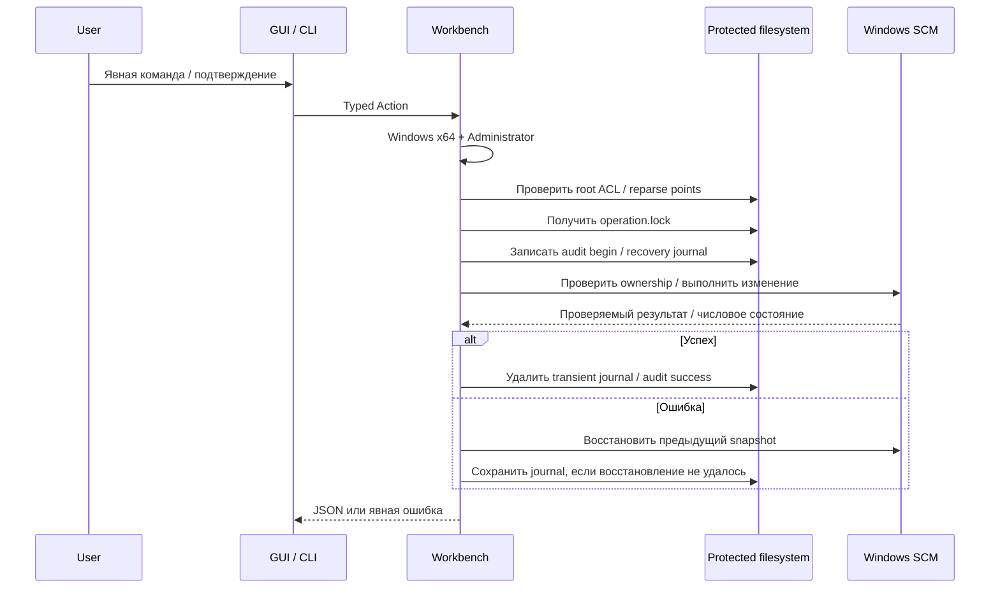

# Архитектура

## Слои

| Слой | Файлы | Ответственность |
|---|---|---|
| Presentation | `app/index.html`, `app/src/main.js`, `app/src/styles.css` | Локальная форма, подтверждение изменений, busy/error states, JSON-результаты |
| UI state | `app/src/ui-state.js` | Ограниченный лог, gate запросов, понятные ошибки и первоначальная валидация |
| Desktop adapter | `app/src-tauri/src/lib.rs` | Один typed IPC command `request`, `spawn_blocking`, закрытие после завершения работы |
| CLI adapter | `core/src/bin/tandem.rs` | Разбор команд, JSON stdout, стабильные категории exit codes |
| Application | `core/src/workbench.rs` | Привилегии, блокировка, аудит, action dispatch, снимки конфигурации |
| Domain | `config.rs`, `hosts.rs`, `service.rs`, `zapret/` | Политики, парсер стратегии, жизненный цикл службы и обратимые изменения |
| Infrastructure | `bundle.rs`, `network.rs`, `files.rs` | HTTPS, ZIP policy, staging, ограниченный ввод, replacement и lock |
| Windows boundary | `platform.rs`, `sys.rs` | Known folders, ACL, SCM query, один доверенный `sc.exe` |

Core использует `serde`, `serde_json`, `thiserror`, `sha2`, `url`, `ureq` и `zip`. Frontend не имеет npm runtime/dev dependencies. Tauri/Rust dependencies остаются настоящими зависимостями: «нулевые npm-зависимости» не означает «приложение без зависимостей».

## Поток изменения



## Привилегии и каталог

Изменяемые данные находятся в `Program Files\TandemWorkbench`, а не рядом с произвольным EXE, в текущем каталоге или user-writable AppData. Путь получается через Windows known-folder API, не через изменяемую переменную `SystemRoot`/`ProgramFiles`.

`prepare_root` создаёт directory с защищённой DACL и владельцем Administrators, разрешает чтение обычным пользователям и полный доступ Administrators/SYSTEM. Затем проверяет владельцев, write rights и отсутствие symlink/junction/reparse points. Нестандартная/неподдерживаемая ACL приводит к отказу, а не к молчаливому ослаблению защиты. Эта Windows-реализация требует отдельной проверки на настоящей системе.

Текущая версия не содержит отдельного privilege broker: для изменений весь процесс нужно явно запустить elevated. Это существенное оставшееся архитектурное ограничение; CSP и отсутствие shell plugin уменьшают поверхность, но не заменяют изоляцию privileged helper.

## Дерево данных

```text
Program Files/TandemWorkbench/
  config.json
  operation.lock
  events.jsonl
  events.previous.jsonl
  engine/
    .tandem-manifest.json
    bin/
    lists/
      ipset-all.txt
      ipset-source.txt
    general*.bat
  engine.previous/
  engine.next/                (только при подготовке)
  engine.unpack/              (только staging)
  engine.swap/                (промежуточный rollback)
  service-recovery.json       (при незавершённом изменении)
  deploy-recovery.json
  settings-recovery.json
  hosts-recovery.json         (до явного восстановления hosts)
```

Служба и установщик GUI — разные сущности. Закрытие GUI не останавливает persistent Windows-service. Удаление службы не удаляет движок, общий WinDivert или hosts. Удаление GUI-установщика не является процедурой полного удаления сетевых изменений.

## Блокировки и завершение

- UI запрещает конкурирующие запросы одним `createRequestGate` и освобождает его в `finally`.
- Tauri имеет отдельный atomic busy guard: обход UI не позволяет запустить второй worker в том же процессе.
- `operation.lock` использует файловую блокировку Rust 1.89+ между процессами. Не удаляется после каждого действия; ОС освобождает lock при закрытии handle/процесса. Нет stale-PID lock-файлов.
- При запросе закрытия окно перестаёт принимать работу и ждёт завершения активного worker. Оно не прерывает запись посередине. Аварийное завершение ОС всё равно возможно — для этого нужен journal.
- Вызов `sc.exe` получает 15-секундный предел; процесс завершается и reap-ится. Вывод читается обоими reader threads, сохраняются только первые 128 KiB каждого потока.
- Переход состояния службы ожидается ограниченным polling: 200 попыток с паузой 100 ms. Чтение SCM не зависит от локализованного текстового вывода.
- DNS имеет максимум восемь незавершённых resolver workers на процесс. Timeout возвращает ошибку; застрявшие системные DNS-вызовы не могут неограниченно размножать threads.

## Стратегия — данные, не программа

Парсер объединяет caret continuations, пропускает batch preamble/comments, находит ровно один допустимый `winws.exe` invocation, разбирает balanced double quotes, заменяет известные переменные без учёта ASCII-регистра и валидирует параметры. Шелл-операторы, неразрешённые placeholders, опасные filename components и неподдерживаемые flags отклоняются.

Поддерживается явный поднабор argument language Flowseal, не полноценный интерпретатор cmd.exe. Файловые аргументы могут ссылаться непосредственно на `bin/` или `lists/`; параметры записи debug/auto-hostlist и произвольный shell не разрешены. Отсутствующий file reference приводит к ошибке preview/install. Новые upstream flags нужно включать после тестирования, а не автоматически пропускать дальше.

Game-filter disabled использует upstream sentinel `12`, а не пустую строку с некорректными портами. Динамические `.bat` side effects не выполняются. Пустые optional user lists создаются непосредственно в staging. Глобальные TCP timestamps не включаются автоматически.

## Транзакции и восстановление

Это журналируемые filesystem/SCM операции, **не ACID-транзакция базы данных** и не гарантия от аппаратной порчи диска.

- Служба: snapshot конфигурации и состояния до изменения; при ошибке восстановление только собственной службы. Состояния transitioning/paused/unknown не угадываются.
- Настройки: резервируются `config.json`, `ipset-all.txt`, `ipset-source.txt`; восстановление разрешает только эти пути.
- ZIP: проверка целостности и paths → отдельный staging → PE/layout checks → `engine.next` → promotion. Сначала должен отсутствовать Tandem-service. Предыдущий пакет сохраняется; recovery восстанавливает старую установку после прерванной promotion.
- Rollback пакета: отдельная запись с SHA целевой сохранённой версии и directory swap. Recovery может завершить ранее начатый swap.
- Hosts: сохраняются исходные bytes как UTF-8-текст и hashes. При внешнем изменении текущего файла автоматический restore запрещён. Действия стороннего elevated editor не образуют общую транзакцию с Tandem; compare-before-replace уменьшает, но не устраняет все cross-application races.

Запись manifest фиксирует checksum исходного ZIP, а не continuously attested checksum всех изменяемых installed files.
